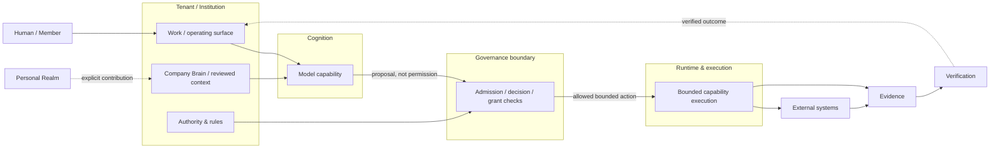

# System Map

`UPD-MAP-001` · `ORIENTATION / CARTOGRAPHY` · `PUBLIC_ABSTRACTED` · `ADOPTED`

> **Why this exists**  
> UNITERA is easier to understand as interacting responsibility and trust domains than as a list of services or repositories.



| Context | Public projection |
|---|---|
| **You are here** | Start → System Map |
| **System layer** | Human → Tenant/Context → Cognition → Governance → Runtime/Execution → Evidence |
| **Authority** | Capability or cognition does not create authority; authority is checked separately |
| **Boundary** | Local/personal, institutional, cognition, governance and external-effect boundaries |
| **Maturity** | Architecture established; implementation maturity varies by area |

## Public topology

> Conceptual public projection — not deployment, service, repository, protocol or security topology.

## Read the boundaries

| Boundary | What crosses it | What does **not** cross automatically |
|---|---|---|
| Personal → institutional | explicit, purpose-bound contribution | personal continuity, permissions, hidden memory |
| Context → cognition | sufficiently relevant approved context | institutional truth or authority |
| Cognition → governance | analysis / proposal | execution permission |
| Governance → runtime | a currently valid bounded authorization path | unrestricted autonomy |
| Runtime → external system | allowed effect | broader capability than the approved action |
| Execution → evidence → verification | receipt/evidence and later outcome checks | receipt ≠ verified success |

## Drill down

- [Human Agency & Model Sovereignty](human-agency-and-model-sovereignty.md)
- [Authority & Source-of-Truth model](authority-and-source-model.md)
- [Local Runtime Node × Personal Realm](local-node-personal-realm-trust-boundary.md)
- [Cognition runtime](../runtime/cognition-runtime.md)
- [Governed external effect](../runtime/governed-effect.md)
- [Current public state](../status/current-state.md)
