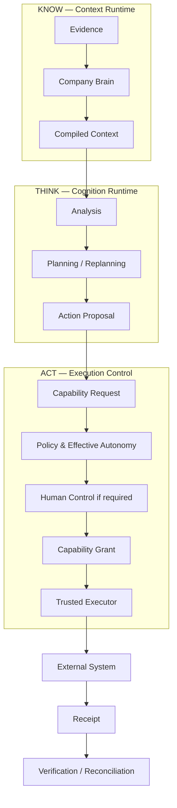

# System Overview

**Status:** PUBLIC PROJECTION  
**Authority:** none by itself

UNITERA separates organizational knowledge, cognition, and external action so that richer AI reasoning cannot silently expand business authority.

## System thesis

UNITERA can be summarized as **evidence-grounded, context-compiled, authority-separated execution**.

The architecture intentionally avoids treating a model, prompt, harness, external tool, or adapter as an authority boundary. Authority remains explicit in owning domains and runtime enforcement.
