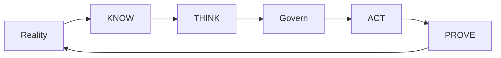

# UNITERA — Overview

**Disclosure:** PUBLIC_CORE · PUBLIC_ABSTRACTED · PUBLIC_STATUS

**Authority:** none by itself

UNITERA is a customizable AI operating system for organization-specific agentic
work. It connects a governed **Company Brain** with KNOW/THINK/ACT, a
**Personal Realm**, and accountable effect.

## Core principles

- **Human Agency:** people and institutions retain decision sovereignty.
- **Model Sovereignty:** models are replaceable cognition tools, not sources of
  authority.
- **Authority Separation:** knowledge, proposal, approval, effect, and review
  remain distinguishable.
- **Governed Effect:** a proposed action is not yet an authorized effect.
- **Resume Continuity:** work can continue with traceable context without
  silently inheriting rights.

*Conceptual public projection — not deployment, service, repository, protocol or security topology.*

## Public maturity

The governed core is contractually described and partly materialized. Further
product and runtime elements are under implementation or in pilot preparation.
This statement is neither production activation nor a claim of complete
end-to-end readiness.

The [public disclosure policy](reference/public-disclosure-policy.md) explains
the publication boundary.

---

[← Previous: Documentation Index](README.md) · [Index](README.md) · [Next: UNITERA — Executive Overview →](presentation/executive-overview.md)
