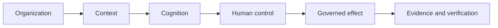

# UNITERA — Executive Overview

**Disclosure:** PUBLIC_CORE · PUBLIC_ABSTRACTED · PUBLIC_STATUS

**Authority:** none by itself

AI can analyze, draft, and automate. The harder question is when AI-assisted
work may become binding reality. UNITERA therefore separates context,
cognition, authority, effect, and proof.

*Conceptual public projection — not deployment, service, repository, protocol or security topology.*

## Public value proposition

- Context does not silently become permission.
- Model capability does not silently become authority.
- Binding effect remains bounded, reviewable, and attributable.
- Personal continuity remains separate from institutional responsibility.

The governed core is partly materialized; complete product journey and
end-to-end production readiness are not claimed.

---

[← Previous: UNITERA — Overview](../overview.md) · [Index](../README.md) · [Next: Current public state →](../status/current-state.md)
