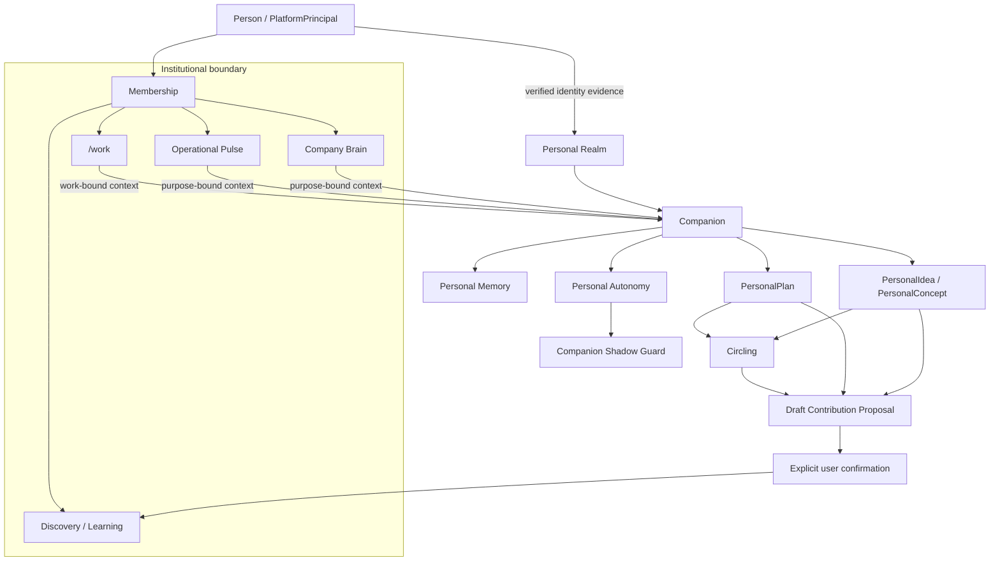

# Personal Realm, Companion, Personal Memory & Circling

**Status:** PUBLIC PROJECTION — OWNER-DECIDED ARCHITECTURE; OWNER-REPO FOUNDATION MERGED  
**Authority:** none by itself  
**Owner surface:** `baum777/unitera_companion`  
**Owner-main materialization:** `main@8dd8112a74631516c134bc3fc528d6220cdd27a7`, PR #1 merged  
**Cross-repo source adoption:** pending  
**Runtime activation:** none

This page supersedes the earlier public candidate page that used **Personal Domain / Member Companion** terminology.

The owner-finalized architecture now names the first-class personal UNITERA continuity boundary **Personal Realm**.

> **The Company Brain remembers the company. The Companion remembers the person. Circling preserves what may matter before commitment.**

## Source posture

The 20-step Owner Grill-Me finalization established the architecture direction and designated `unitera_companion` as the dedicated semantic owner surface.

The owner materialization from the 20-step decision set is now merged to the designated owner repository's `main`. Cross-repository adoption and runtime activation remain separate. Therefore this public page distinguishes:

~~~text
Owner decision
= finalized

Owner-repo architecture materialization
= merged to owner main (`8dd8112`)

Cross-repo adoption
= pending

Runtime / production activation
= not performed
~~~

Public documentation creates no authority of its own.

## Personal Realm

**Personal Realm** is a first-class, person-bound isolation, continuity and context domain for a persistent UNITERA relationship across sessions, devices and organizational memberships.

It is not an institutional authority domain.

~~~text
PersonalRealm != CompanyTenant
PersonalRealm != Membership
PersonalRealm != PlatformPrincipal
PersonalRealm != Authority
~~~

The former terms are now treated as:

~~~text
Personal Realm
= owner-approved preferred term

Personal Domain
= transition / alternative term

Personal Tenant
= historical working term; discouraged in normative use
~~~

## Owner topology

~~~text
unitera_companion
→ Personal Realm semantics and lifecycle
→ PersonalRealmBinding relationship
→ Companion
→ Personal Memory
→ Circling
→ PersonalIdea / PersonalConcept / PersonalPlan
→ personal-side ContributionProposal
→ Personal Autonomy / Routine Binding
→ Shadow Guard semantics
→ Personal Realm backup / transfer / restore

Identity Authority
→ Person / PlatformPrincipal identity evidence

Tenant Control Plane
→ Membership / Company Tenant relationships

coreos
→ institutional Discovery / Claim / Learning / Company Brain

unitera-os
→ provider-neutral Capability / Grant / Execution contracts
~~~

A repository path or runtime implementation does not inherit authority outside the concept it owns.

## Architecture at a glance

The same person may participate in multiple Company Tenants. Their institutional contexts remain isolated.

## Bootstrap and Local Runtime Node

A Personal Realm is **not** automatically created at account sign-up.

The owner direction binds initial Companion bootstrap to:

1. an authenticated PlatformPrincipal;
2. a successfully bound Local Runtime Node;
3. an initialized local UNITERA workspace;
4. explicit Companion bootstrap.

~~~text
Local Node + local workspace
= bootstrap / materialization conditions

Local Node
!= Personal Realm identity

Node replacement
!= New Personal Realm
~~~

## Local-first persistence and multi-node continuity

The Personal Realm is **local-first**.

~~~text
Primary local workspace
→ authoritative working materialization

Encrypted remote layer
→ sync / backup / transport / recovery substrate
~~~

The remote service is not the semantic owner and is not the default plaintext canonical personal store.

One Personal Realm may bind multiple Local Runtime Nodes.

Multi-writer synchronization is allowed, but semantic meaning is protected:

~~~text
mechanically safe / CRDT-safe metadata
→ deterministic merge may be allowed

semantic content conflict
→ preserve both revisions
→ explicit reconciliation

last-write-wins
!= default semantic conflict policy
~~~

## Backup, transfer and recovery

Personal Realm backups must be **hardware-key signed**.

Normal restore requires:

- valid hardware-key proof;
- valid Principal/Person binding;
- backup integrity verification;
- target Local Runtime Node binding.

Account-loss recovery uses a separate break-glass path:

~~~text
hardware-key proof
+ independent identity re-verification
+ explicit recovery procedure
→ new/revised PersonalRealmBinding
→ restore
~~~

Hard rule:

~~~text
HardwareKey != PersonIdentity
Backup possession != RestoreAuthority
~~~

## Personal Memory

Personal Memory is deliberately retained user-bound continuity information.

It is not conversation history, Runtime State or institutional truth.

~~~text
Conversation / Observation
→ Memory Candidate
→ Memory Eligibility
→ retain | ask | transient | reject
→ Personal Memory
~~~

The owner direction uses a hybrid governance model:

- the Companion may autonomously retain eligible low-risk continuity memory;
- sensitive, uncertain, inferred, identity-relevant, materially consequential, company-derived or policy-restricted memory requires stronger control;
- the person must be able to inspect, correct, supersede, forget and export Personal Memory.

~~~text
ConversationHistory != PersonalMemory
PersonalMemory != RuntimeState
PersonalMemory != CompanyBrain
~~~

## Company-derived Personal Memory

Company context that the Companion is allowed to see does not automatically gain durable personal residency.

~~~text
Company Context Access
!= Personal Memory Residency Permission
~~~

Durable company-derived memory requires a **CrossBoundaryResidencyDecision**.

Possible outcomes include:

~~~text
RETAIN
TRANSFORMED_RETAIN
TRANSIENT_ONLY
DENY
~~~

When the relevant Membership ends, retained company-derived Personal Memory must be reviewed again.

## Company access to Personal Memory

The owner decision is **default deny**.

A Company Tenant does not receive raw Personal Memory access.

Only an explicit **PersonalContextProjection** may cross into company context, and it must be:

- explicitly user-authorized;
- destination-tenant-bound;
- purpose-bound;
- scope-bounded;
- time-bounded;
- revocable;
- provenance-preserving.

~~~text
PersonalContextProjection != PersonalMemory
Projection != Company ownership
Projection != Company Brain truth
~~~

## Circling

Circling is now owner-approved as a **first-class semantic lifecycle/relationship**, not as one universal container entity.

Its purpose remains:

~~~text
attention != commitment
~~~

Personal objects such as:

- PersonalIdea;
- PersonalConcept;
- question;
- pattern;
- tension;
- hypothesis;
- opportunity;

may enter a Circling relationship/state.

~~~text
Circling != Priority
Circling != Commitment
Circling != WorkOrder
Circling != Claim
Circling != Decision
~~~

## Personal ideation grammar

The owner-approved terminology separates:

~~~text
PersonalIdea
!= PersonalConcept
!= PersonalPlan
~~~

and:

~~~text
PersonalConcept != CanonicalConceptIdentity
PersonalConcept != Claim
PersonalPlan != WorkOrder
~~~

A possible progression is:

~~~text
Impulse
→ PersonalIdea
→ Circling / development
→ PersonalConcept
→ personal evaluation
→ landing
~~~

Landing may lead to a PersonalPlan, a Work Proposal, a Discovery contribution, a BrainChangeProposal/LearningCandidate, archive or discard. Landing never implies destination acceptance.

## Personal → institutional contribution

The Companion may identify organizational relevance and prepare a **draft ContributionProposal**.

It may not submit that proposal across the Personal/Institutional Boundary by itself.

~~~text
Personal cognition
→ Companion prepares ContributionProposal
→ EXPLICIT USER CONFIRMATION
→ lifecycle-aware institutional command
~~~

Depending on the current Company Brain lifecycle, the institutional command may be:

- DiscoveryInput;
- CandidateChangeRequest;
- BrainChangeProposal / LearningCandidate.

~~~text
ContributionProposal != Claim
ContributionProposal != ClaimEligibility
ContributionProposal != Brain activation
~~~

## Companion autonomy

The owner-finalized architecture rejects one undifferentiated "trust score".

Internally these remain separate:

~~~text
Relationship Familiarity
= how well the Companion knows the person

Qualification
= evidence of reliable behavior in a defined scope

Global Autonomy Tier
= maximum qualitative delegation ceiling

Capability-specific Delegation
= operative delegated autonomy

Effective Capability Tier
= current runtime-attenuated autonomy
~~~

Hard rule:

~~~text
effective capability tier
<= capability delegated tier
<= global Companion ceiling
~~~

Relationship familiarity and qualification may improve interpretation and support promotion eligibility. Neither creates permission by itself.

The UI may show a simplified relationship/trust indicator, but that projection is informational only.

## Promotion and attenuation

Within-tier bounded growth may occur automatically only when:

- the person already authorized the relevant bounds;
- qualification supports it;
- no hard-safety failure exists;
- no new capability/effect class is introduced.

Cross-tier promotion always requires explicit user approval and a new delegation revision.

Runtime attenuation or demotion may occur automatically, including per capability.

## Companion Shadow Guard

Autonomous effectful Companion actions receive an additional **independent Shadow Guard**.

The guard has two layers.

### Deterministic layer — always active

Checks include:

- exact Realm/identity binding;
- capability and delegation;
- target and payload bounds;
- node/adapter binding;
- expiry/revocation;
- hard policy;
- cross-tenant/cross-realm constraints.

These checks are never sampled away.

### Semantic reasonableness layer

The independent semantic review tests whether the proposed action is coherent with:

- current user intent;
- known routine;
- target;
- effect magnitude;
- external visibility;
- destructiveness;
- sensitivity;
- novelty/deviation.

Candidate outcomes:

~~~text
PASS_EXISTING_PATH
FREEZE_PENDING_USER
DENY
ESCALATE
~~~

A Shadow PASS never creates authority.

### Tier-dependent review density

~~~text
LOW AUTONOMY
→ semantic Shadow review for every autonomous effectful action
→ mandatory fail-closed

HIGHER AUTONOMY
→ strongly qualified low-risk routines may move to sampled semantic review

NOVEL / DEVIATING / SENSITIVE / ELEVATED-RISK
→ return to FULL semantic review
~~~

Post-effect verification remains separate:

~~~text
Dispatch
→ Receipt
→ Verification
~~~

Ambiguous effects enter reconciliation rather than blind retry.

## Examples of bounded personal autonomy

Low-risk examples that may eventually qualify for autonomous execution under exact delegation include:

- appending or editing notes inside an exact personal notes root;
- creating a private calendar entry;
- correcting a private calendar event within bounded parameters.

A technically similar action may have very different semantic risk:

~~~text
move private reminder by 30 minutes
!=
move external meeting with participants
~~~

Personal does not mean harmless.

Higher-impact classes such as financial transfers, contracts, security/identity mutations, permission escalation, destructive mass deletion, cross-tenant transfer or material third-party commitments require separately adopted policy/authority and do not emerge automatically from a higher Companion tier.

## Relationship to /work

The existing product direction remains **work-first, chat/Companion-secondary** for organizational operation.

~~~text
PersonalPlan != WorkOrder
Companion thread != Work Object
Personal Realm != Company Tenant
~~~

The Companion may support Work by combining eligible personal context with least-sufficient tenant-bound Work and Company context. It does not replace `/work`, Company Brain or institutional Authority.

## Current public status

Owner decisions for this architecture are finalized and the architecture foundation is merged to the designated owner repository's `main`.

This public page does **not** claim that:

- cross-repo authority bindings are already adopted;
- Personal Realm runtime exists;
- production Companion effects are enabled;
- the global UNITERA Source Pointer has changed;
- unresolved privacy/legal/retention authority outside the decided architecture has been silently closed.

The next gates are canonical contract materialization, exact cross-domain bindings, persistence/crypto implementation profiles, negative tests, low-risk effect pilots, qualification, cross-repo source adoption and a separate production-activation decision.
