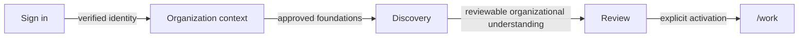

# From sign-in to Discovery

Status: `PUBLIC_CORE`

The public journey describes product behavior, not authentication or service topology.

Discovery helps capture mission, operating model, boundaries, sources and open questions in a traceable way. Results remain reviewable before they become active institutional context.

> Conceptual public projection — not deployment, service, repository, protocol or security topology.
