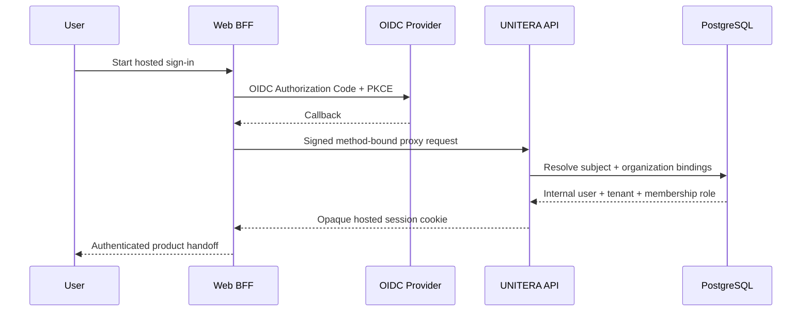
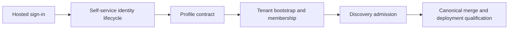

# Sign-up → Tenant → Discovery Journey

**Status:** PUBLIC PROJECTION with explicit implementation gaps  
**Authority:** none by itself  
**Source basis:** `Unitera_Systems/main@786d03c`, Discovery branch `7f7a3b3`, and supplied Tenant/Product/Company Brain sources

## Intended production journey

```mermaid
flowchart TD
    V[Visitor] --> I[Hosted Sign-up or Sign-in]
    I --> S[Opaque hosted session]
    S --> P[Personal profile]
    P --> T[Tenant bootstrap or selection]
    T --> M[Verified membership and role]
    M --> F[First Contact]
    F --> D[Discovery workspace]
    D --> C[Claims, sources, conflicts, open decisions]
    C --> R[Server-side readiness]
    R --> B[Candidate and exact-revision review]
    B --> A[Materialization and activation]
    A --> W[First advisory Work Order]
    W --> X[/work]
```

This is the semantically correct end-to-end journey. It is **not** yet one fully canonical production flow.

## What is canonical on `Unitera_Systems/main`

Hosted authentication is materially implemented:



The important boundary is:

```text
external OIDC identity
!= internal user
!= tenant
!= membership authority
```

External subject and organization identifiers are resolved through provisioned internal bindings. Roles remain membership-derived, and tenant-scoped resolution runs under PostgreSQL isolation.

## What is not yet canonical

The repository tree and route surface do not currently evidence a complete self-service chain for:

- public account creation under UNITERA-owned lifecycle rules;
- required personal-profile completion;
- safe tenant creation/selection and ownership establishment;
- controlled initial membership provisioning;
- a canonical handoff from those states into Discovery.

Hosted sign-in readiness must therefore not be described as production-ready sign-up/onboarding readiness.

## Discovery implementation posture

The remote branch `codex/discovery-pilot-readiness-closure` is currently 11 commits ahead of and 0 behind `Unitera_Systems/main`, at `7f7a3b35e957dafaf0d3cb11eb46c5788ddecdfe`.

It contains a qualified development slice with:

- tenant-isolated Discovery persistence and migration `0050`;
- API controller, service, repository, and deterministic cognition backend;
- `/work/discovery` and session UI routes;
- structured knowledge, provenance, review, and first-work projections;
- integration, smoke, negative-boundary, and qualification evidence.

The branch reports build, migrations, governance, premerge, and 1,845-test qualification with a database. Because it is not canonical `main`, this repository labels it **QUALIFIED DEVELOPMENT SLICE**, not production-active.

## Product closure gates



The production-ready onboarding slice closes only when each transition has an owning contract, fail-closed error state, tenant-isolation proof, migration path, canonical-main materialization, and deployed end-to-end evidence.
