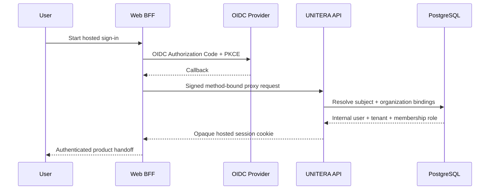

# Sign-up → Tenant → Discovery Journey

**Status:** PUBLIC PROJECTION with explicit implementation gaps  
**Authority:** none by itself  
**Source basis:** `Unitera_Systems/main@786d03c`, Discovery PR #94 at `19e70f2`, Production Interface `main@d7cbf8c`, and supplied Tenant/Product/Company-Brain sources

## Intended production journey

```mermaid
flowchart TD
    V[Visitor] --> I[Hosted Sign-up or Sign-in]
    I --> S[Opaque hosted session]
    S --> P[Personal profile]
    P --> T[Tenant bootstrap or selection]
    T --> M[Verified membership and role]
    M --> F[First Contact]
    F --> D[Discovery workspace]
    D --> C[Claims, sources, conflicts, open decisions]
    C --> R[Server-side readiness]
    R --> B[Candidate and exact-revision review]
    B --> A[Materialization and activation]
    A --> W[First advisory Work Order]
    W --> X[/work]
```

This remains the semantically correct end-to-end journey. It is **not yet one fully canonical production flow**.

## Canonical hosted-auth foundation

Hosted authentication on `Unitera_Systems/main` is materially implemented:



The important boundary is:

```text
external OIDC identity
!= internal user
!= tenant
!= membership authority
```

External subject and organization identifiers are resolved through internal bindings. Roles remain membership-derived, and tenant-scoped resolution is server-side.

## Dedicated Production Interface progress

A separate implementation repository now materially improves the product-facing part of this journey:

```text
baum777/unitera-production-interface
main@d7cbf8c
role = B — PRODUCT_UI_PLUS_BFF
```

Its merged PR #1 contains the migration-closure stack and a governed Settings/Profile surface. The qualified PR head had a successful remote CI run.

Materialized product-owned settings include:

- Profile fields;
- Preferences such as interface language, form of address, communication style and timezone;
- Account projection;
- Workspace, Members and Invitations projections;
- Expert/Admin runtime projections.

The boundary is deliberately fail-closed:

```text
profile setting
!= Membership role

workspace projection
!= Tenant mutation

member list
!= role-management authority

invitation UI
!= invitation command authority

Company Brain projection
!= Company Brain mutation
```

Where the canonical command is unavailable, role-management and invitation actions remain disabled/unavailable.

This closes a **product-surface** gap. It does not by itself prove the complete canonical self-service onboarding lifecycle.

## What is still not canonical end to end

The combined repository evidence still does not prove one fully closed production self-service chain for:

- UNITERA-owned public account creation lifecycle;
- safe Tenant creation/selection and ownership establishment;
- controlled initial Membership creation;
- exact handoff from those states into canonical Discovery;
- canonical merge/deployment of the current Discovery runtime;
- complete activation-to-First-Work production proof.

Hosted sign-in readiness plus a product Profile surface must therefore not be described as a production-ready onboarding funnel.

## Discovery implementation posture

Discovery PR #94 currently points to:

```text
branch: codex/discovery-pilot-readiness-closure
head: 19e70f220a83c331b7fc7f4c9bbd9e3ff9d35893
relative to Unitera_Systems/main:
  ahead: 15
  behind: 0
state: OPEN / QUALIFIED DEVELOPMENT SLICE
```

It contains:

- tenant-isolated Discovery persistence and migration `0050`;
- API controller/service/repository and deterministic cognition backend;
- `/work/discovery` and session UI routes;
- structured knowledge, provenance, review and First-Work projections;
- RLS, integration, smoke, negative-boundary and qualification evidence.

Its PR qualification reports build, migration, governance/premerge and broad unit/integration coverage. Because the PR is still open, this repository does **not** call it canonical main or production-active.

## Product integration review lane

Unitera_Systems PR #98 is a separate open integration lane at `903f025`.

It adds a read-only pilot/product shell and in-stack materialization for natural-person identity/attestation, HumanDecision/DualControlSet and broader Work read models.

All five observed remote workflow families succeed at that exact head.

This matters for the journey because it strengthens:

```text
identity assurance
→ decision/dual-control representation
→ authority-aware work projection
→ product entry
```

but it still remains:

```text
qualified open PR
!= canonical main
!= production activation
```

## Product closure gates


The production-ready onboarding slice closes only when each transition has an owning contract, fail-closed error state, tenant-isolation proof, migration path, canonical materialization and deployed end-to-end evidence.

## Current non-claims

This page does not claim:

- that `unitera-production-interface` owns identity, Membership or Tenant semantics;
- that the Profile/Settings merge closes public self-service Tenant bootstrap;
- that Discovery PR #94 is merged;
- that Product Integration PR #98 is canonical;
- that live effects or production execution are active;
- that the pilot owner freeze is authorized.
