# Tenant, Discovery & Company Brain

**Status:** PUBLIC PROJECTION  
**Authority:** none by itself  
**Source basis:** `coreos/main`, `Unitera_Systems/main`, qualified Discovery branch, and supplied Phase-1/product sources

The Tenant is the institutional security and authority boundary. Authentication establishes an identity session; it does not create tenant ownership, membership, or Company Brain authority.

Discovery is **assisted organizational sensemaking**. Conversation is an input channel; the product object is reviewable organizational knowledge.

```mermaid
flowchart LR
    D[Discovery input] --> E[Evidence and sources]
    E --> C[Claims]
    C --> Q[Eligibility and review]
    Q --> CR[Candidate revision]
    CR --> AP[Exact-digest approval]
    AP --> MR[Immutable Brain revision]
    MR --> AM[Activation manifest]
    AM --> TB[Atomic TenantBrainBinding]
    TB --> W[First advisory Work Order]
```



## Epistemic states

- `founder_confirmed`
- `document_supported`
- `observed`
- `assumption`
- `unresolved`
- `conflicting`

Hard boundaries:

```text
Message != Claim
Claim != Active Institutional Truth
Candidate != Active Brain
Approval != Activation
Activation != Execution Authority
```

## Readiness and review

Readiness means there is enough attributed structure for a reviewable candidate. It does not mean complete organizational truth, zero assumptions, or zero conflict. Material new evidence may reopen `candidate_ready` for a fresh server-side evaluation; not every message is material.

## Product direction

The source-reconciled direction remains **work-first, chat-secondary**:

- `/work` is the primary operating surface;
- chat is work-order contextual or globally tenant-bound support;
- Company Brain context is inspectable infrastructure, not a claim that the UI itself is the truth store;
- when qualified, exactly one bounded advisory first Work Order is selected through trusted eligibility and deterministic ranking;
- no eligible object produces an honest empty state, not an invented priority.

## Implementation status

`coreos` owns the Company Brain authority model and active Foundation baseline. `Unitera_Systems/main` contains Company Brain consumption and authority-runtime surfaces. The current full Discovery runtime and `/work/discovery` experience are qualified on a noncanonical branch; canonical merge and deployment qualification remain separate gates.
