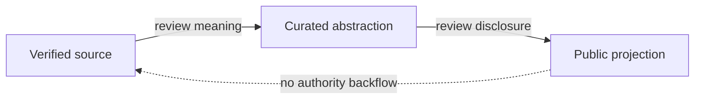

# Governance — Public Documentation Projection

**Disclosure:** PUBLIC_ABSTRACTED
**Authority:** none by itself

This documentation follows four rules:

- The relevant verified source wins on conflict.
- Candidates remain candidates until properly adopted outside this
  documentation.
- Public maturity stays coarse and changes more slowly than engineering state.
- Publication creates no authority, permission, or activation.

*Conceptual public projection — not deployment, service, repository, protocol or security topology.*

Open gaps are named, not closed through documentation.

---

[← Previous: Contributing](contributing.md) · [Index](../README.md) · [Next: Public disclosure policy →](public-disclosure-policy.md)
