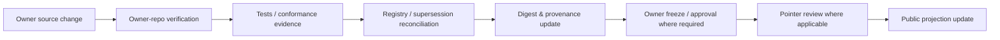

# Governance — Public Documentation Projection

## Classification

- repository_role: `PUBLIC_DOCUMENTATION_PROJECTION`
- authority: `NONE_BY_ITSELF`
- registry_role: `CONSUMER_OF_VERIFIED_REFERENCES`
- may_activate_source: `false`
- may_create_runtime_authority: `false`
- may_create_tenant_authority: `false`
- may_create_capability_or_grant: `false`

## Precedence

When information conflicts, use this interpretation order:

1. Verified canonical artifact in the owning repository.
2. Frozen phase or contract specification.
3. Owner-decision evidence pending formal adoption.
4. Architecture/source candidate.
5. Product/UX projection.
6. Legacy or conversational material.

This ordering is a documentation evaluation rule. It does not create a new authority layer.

## Publication gate

A public statement may be marked `ESTABLISHED` or `MATERIALIZED` only when its source basis supports that label. Candidate material must remain visibly marked `CANDIDATE`. Open gaps must not be silently resolved in documentation.

## Update flow

**Never begin adoption by changing the public documentation or the current source pointer.**

