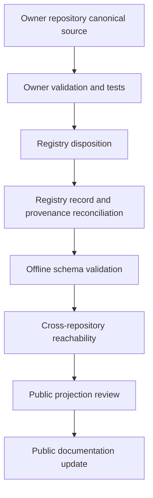

# Registry → Public Publication Flow

**Status:** PUBLIC PROJECTION  
**Authority:** none by itself  
**Source basis:** `unitera-registry/main@a2f4cca` and repository-local publication governance

The Registry is a cross-repository source, authority-reference, provenance, adoption, supersession, consumer, and implementation-binding index. Its bootstrap schema is `1.1.0`.



## Current enforcement posture

Registry `main` requires two distinct checks:

- offline Registry validation;
- cross-repository reachability.

That improves reference integrity. It does not turn the Registry into an authority source or prove runtime behavior.

## Disposition rule

Owning repositories classify Registry consequence before closure:

| Disposition | Meaning |
|---|---|
| `NO_CHANGE` | No adopted Registry-relevant class changed. |
| `UPDATED` | Required Registry write completed and is evidenced by its commit. |
| `REQUIRED_BUT_BLOCKED` | A required Registry update could not be completed. |

## Fail-closed publication rule

Do not begin with a pointer switch. Do not publish candidate or branch-only material as canonical because it appears in a Registry package. Owner materialization and verification come first; Registry reconciliation follows; public projection is last.

```text
Registry reachability != source authority
Registry record != production activation
Implementation binding != runtime qualification
Public projection != backflow authority
```
