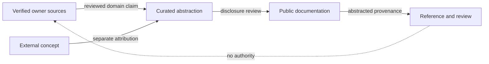

# From source to publication

Status: `PUBLIC_ABSTRACTED`

Referencing makes origin and review understandable without publishing internal topology or creating authority.

> Conceptual public projection — not deployment, service, repository, protocol or security topology.
