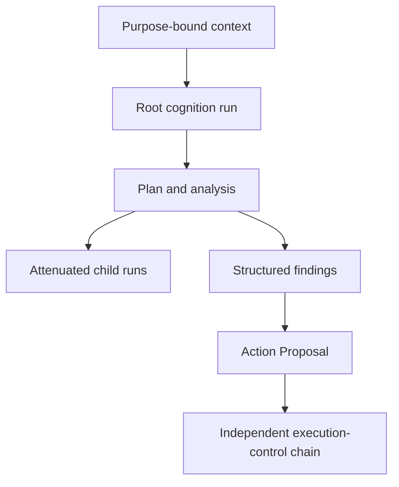

# Cognition Runtime

**Status:** PARTIALLY MATERIALIZED / OPEN RUNTIME GATES  
**Authority:** none by itself  
**Source basis:** `Unitera_Systems/main@786d03c`, source-reconciled KNOW/THINK/ACT material, and noncanonical cognition gate evidence

UNITERA treats cognition as compute, not authority.



## Materialized on canonical `main`

The v1 cognition compute-envelope domain contract and token-accounting guard are materialized. The contract separates:

```text
cognitive capability
× compute envelope
× delegated/effective autonomy
× execution authority
```

More tokens, depth, child runs, or model capability do not create more authority.

## Still open

Canonical `main` does not yet evidence the complete production cognition runtime lifecycle. Remaining gates include:

- concrete root-run authorization and admission binding;
- durable run identity and lifecycle state;
- concurrency and budget reservation/depletion semantics;
- state, memory, context, retention, and evidence classification;
- child-run attenuation and pre-spawn re-evaluation;
- production backend binding and operational qualification.

Noncanonical owner packages describe several of these decisions, but documentation cannot promote them into canonical runtime authority.

## Child-run invariant

```text
child.tenant == parent.tenant
child.scope ⊆ parent.scope
child.capability_surface ⊆ parent.capability_surface
child.expiry <= parent.expiry
child.compute <= reserved parent budget
child.autonomy <= parent.autonomy
```

Replanning may alter the route. It may not expand tenant, objective, capability, autonomy, or authority boundaries.

## Evidence posture

Security evidence should bind run identity, context digest, model-response digest, proposal digest, policy snapshot, and lineage. Full private reasoning transcripts are not required as the default authority proof.
