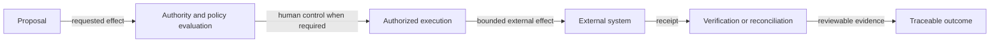

# Governed effect

Status: `PUBLIC_CORE`

Approval is not execution, a receipt is not verification, and an unknown outcome is not an invitation to retry blindly. Real-world effects remain deliberately narrow.

> Conceptual public projection — not deployment, service, repository, protocol or security topology.

---

[← Previous: Model and provider independence](model-and-provider-independence.md) · [Index](../README.md) · [Next: Local runtime boundary →](local-runtime-node.md)
