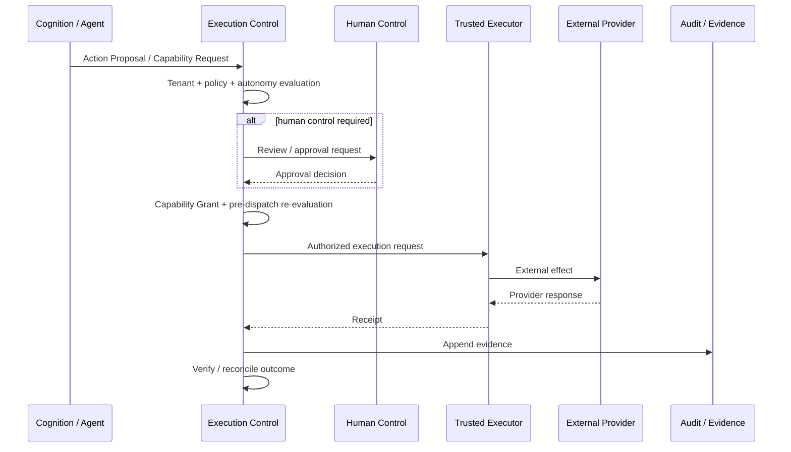

# Governed External Effect

**Status:** ESTABLISHED architecture; exact runtime availability depends on the owning implementation surface.

UNITERA separates approval, grant, external execution, receipt, and verification. External effects must not be dispatched directly from cognition.

## v1 effect boundary

The established technical reference for the single bounded v1 external capability is `email.send.commit`. Broader business workflows may compose around it, but workflow names must not silently become new atomic capabilities.

## Failure rule

Unknown external outcome is not permission to retry blindly. The system must reconcile uncertain effects before deciding whether another attempt is safe.
