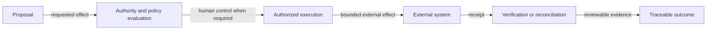

# Governed effect

Status: `PUBLIC_CORE`

```mermaid
flowchart LR
    P["Proposal"] -->|"requested effect"| A["Authority and policy evaluation"]
    A -->|"human control when required"| E["Authorized execution"]
    E -->|"bounded external effect"| X["External system"]
    X -->|"receipt"| V["Verification or reconciliation"]
    V -->|"reviewable evidence"| R["Traceable outcome"]
```

Approval is neither a grant nor execution, a receipt is not verification, and an unknown outcome is not an invitation to retry blindly. Real-world effects remain deliberately narrow.

Where human control is required, what counts is the currently evidenced person
authorized for this exact decision. Different accounts do not prove independent
people. A positive control evaluation is not a grant; a material change to the
proposal or applicable rules requires a new evaluation. See [Identity, Human
Control and Authority](../architecture/identity-human-control-and-authority.md).

> Conceptual public projection — not deployment, service, repository, protocol or security topology.

---

[← Previous: Model and provider independence](model-and-provider-independence.md) · [Index](../README.md) · [Next: Local runtime boundary →](local-runtime-node.md)
