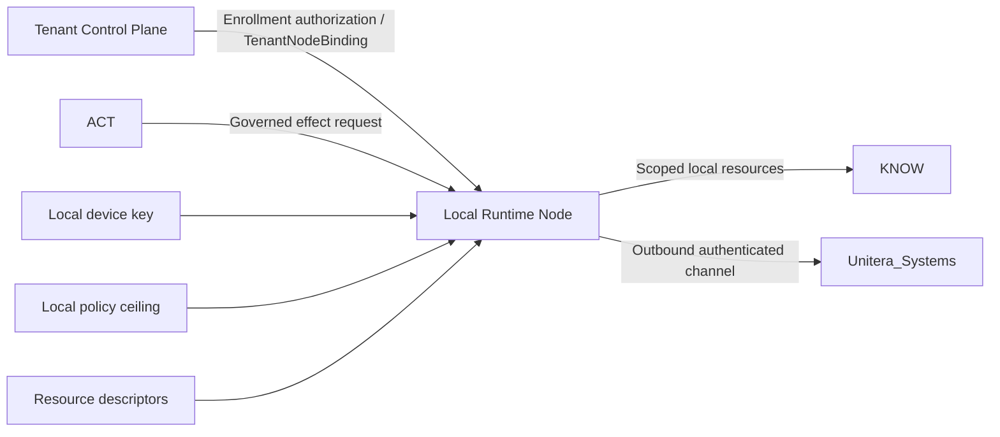

# Local Runtime Node

**Status:** CANDIDATE — not repo-canonical, not source-adopted, not runtime-active by this document.

The Local Runtime Node is a proposed deployment and trust-boundary extension for governed access to a tenant's physical computer. It is **not a fourth KNOW/THINK/ACT plane**.

Candidate security posture:

- explicit enrollment authorization
- locally generated asymmetric operational key
- proof of possession
- separate TenantNodeBinding
- short-lived outbound channel
- local policy ceiling
- zero implicit resources, adapters, or grants at enrollment
- optional hardware attestation as an assurance enhancement

**Locality may reduce data movement; locality never creates trust or permission by itself.**
