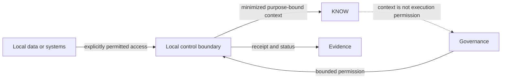

# Local runtime boundary

Status: `PUBLIC_ABSTRACTED`

A local runtime boundary can make approved local resources or systems reachable to UNITERA. Reachability alone permits neither reading nor execution.

Local sovereignty means controlled proximity to data and effects, not universal access. Transport, identity, credential and enforcement details remain in internal owner sources.

> Conceptual public projection — not deployment, service, repository, protocol or security topology.

---

[← Previous: Governed effect](governed-effect.md) · [Index](../README.md) · [Next: Pilot and production readiness →](../status/pilot-production-readiness.md)
