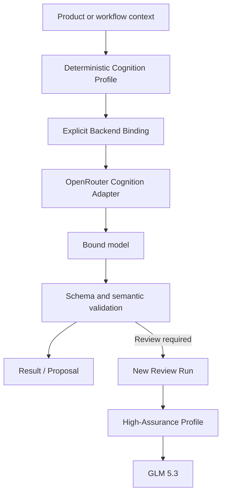
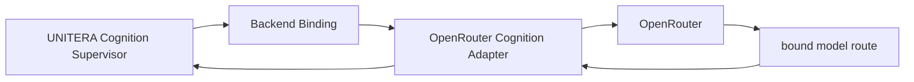
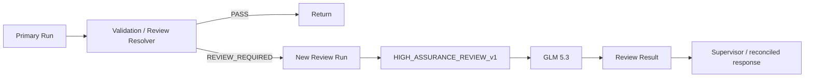
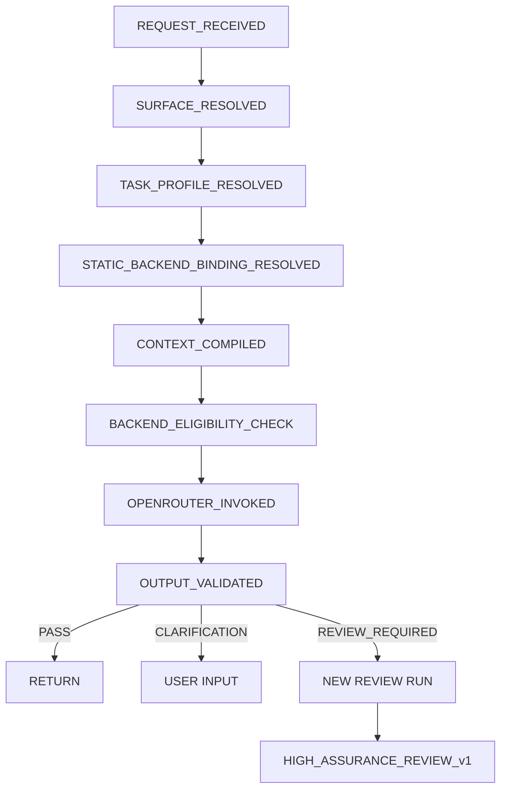
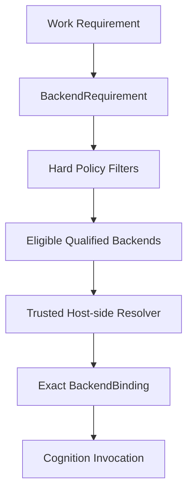

# Pilot Model Selection, OpenRouter, and Governed Routing

**Status:** PUBLIC PROJECTION | CANDIDATE / PILOT WORKING PLAN  
**Authority:** none by itself  
**As of:** 2026-08-30  
**Source basis:** source-reconciled Runtime / KNOW / THINK / ACT material, Backend-Agnostic Processing candidate, Open-Weights long-term plan, and dated pilot benchmark evidence  
**Important:** the model bindings described here are pilot decisions. They are neither Source-of-Truth authority nor claims of general model superiority.

UNITERA treats model selection as a **Cognition Runtime concern**, not an authority decision.

The pilot therefore pursues two goals at the same time:

1. use a suitable model for each class of cognitive work;
2. prevent model choice, provider choice, routing, or model output from creating additional institutional authority.

The core rule is:

```text
Model Selection != Authority
Provider Selection != Authority
Model Output != Institutional Truth
Model Qualification != Capability Grant
Higher Model Capability != Higher Autonomy
```

---

## 1. Pilot decision

UNITERA does **not** introduce a free dynamic model router in the pilot.

Instead, each known product situation is deterministically mapped to a Cognition Profile. That profile has an explicit static backend binding.



The pilot therefore uses:

```text
known context
→ known profile
→ known model binding
```

not:

```text
prompt
→ model chooses "best model"
→ arbitrary route
```

---

## 2. Current pilot portfolio

| Cognition Profile | Working pilot binding | Role |
|---|---|---|
| `DISCOVERY_v1` | **Qwen 3.8 Max** | structured Discovery and organizational sensemaking |
| `GRILL_ME_v1` | **DeepSeek V4 Flash 0731** | critical challenge of conclusions and recommendations |
| `CHAT_ASSIST_v1` | **DeepSeek V4 Flash 0731** | daily global tenant-bound assistant |
| `WORK_ASSIST_v1` | **DeepSeek V4 Flash 0731** | Work-Object-bound cognition |
| `HIGH_ASSURANCE_REVIEW_v1` | **GLM 5.3** | deep review and escalation route |
| `SHADOW_CHALLENGER_v1` | **Tencent HY3** | shadow evaluation, never user-facing |

These bindings are **profile-specific**. UNITERA does not qualify “the best model”; it qualifies a combination of:

```text
Model
× Harness Revision
× Task Profile
× Runtime Configuration
```

A model may therefore lead one profile while remaining only a challenger or shadow candidate in another.

---

## 3. Why this distribution?

The pilot choice is based on Discovery and Grill-Me comparisons run through 2026-08-30.

### Discovery

Repeated multi-case runs produced this working interpretation:

- **GLM 5.3** acted as a quality reference with very strong semantic stability, but materially higher runtime;
- **DeepSeek V4 Flash** showed very high quality and often lower latency, with more runtime variance;
- **Qwen 3.8 Max** emerged as a strong interactive Discovery candidate because quality, latency, and consistency were balanced;
- smaller/faster Qwen routes remained Fast-Path candidates but showed observed semantic risks around currentness, supersession, and responsibility elevation.

### Grill-Me

Across the first three broad Grill-Me cases, the working picture was:

| Model | cumulative quality | observed runtime tendency | Working role |
|---|---:|---|---|
| GLM 5.3 | highest | slow | Quality / Assurance Reference |
| DeepSeek V4 Flash | very high | fast to medium | Balanced Leader |
| Tencent HY3 | high | fast to medium | Shadow Challenger |
| Qwen 3.8 Max | high but more variable | medium | High-Variance Challenger |

These are **dated evaluation signals**, not a permanent model ranking. A model or version change requires profile-specific re-evaluation.

---

## 4. Product mapping

The model architecture follows the product architecture.

```text
Discovery
→ DISCOVERY_v1
→ Qwen 3.8 Max

/work + active Work Object
→ WORK_ASSIST_v1
→ DeepSeek V4 Flash

global assistant
→ CHAT_ASSIST_v1
→ DeepSeek V4 Flash

explicit Grill-Me
→ GRILL_ME_v1
→ DeepSeek V4 Flash

material / complex review
→ HIGH_ASSURANCE_REVIEW_v1
→ GLM 5.3

shadow sampling
→ SHADOW_CHALLENGER_v1
→ Tencent HY3
```

Work and Chat may use the same model without becoming the same behavior. Their differences live in:

- harness;
- Context Policy;
- Output Contract;
- Work/Tenant binding;
- Compute Envelope;
- failure/escalation policy.

```text
same model
!=
same cognition profile
```

---

## 5. OpenRouter in the pilot

OpenRouter is treated as a **Cognition Backend Gateway / Provider Adapter**.

It is not:

- a UNITERA Capability;
- Authority;
- a Policy Engine;
- a Workflow Engine;
- the Company Brain;
- an Execution Adapter for business effects.



The semantic layer remains provider-neutral. OpenRouter is a concrete runtime implementation behind the binding.

---

## 6. OpenRouterCognitionAdapter

The pilot should not create model-specific service sprawl.

Preferred provider-neutral interface:

```ts
interface CognitionBackendAdapter {
  invoke(request: CognitionInvocation): Promise<CognitionResult>
}

interface OpenRouterCognitionAdapter extends CognitionBackendAdapter {
  providerId: "openrouter"
}
```

Not preferred:

```text
QwenDiscoveryService
DeepSeekChatService
GLMReviewController
```

Preferred:

```text
Cognition Profile
→ Backend Binding
→ CognitionBackendAdapter
```

This keeps later replacement by another gateway, local open-weights inference, or dedicated compute possible without redefining Product or Authority semantics.

---

## 7. Cognition Profile

A Cognition Profile binds the behavioral runtime contract.

Candidate shape:

```yaml
CognitionProfile:
  profile_id:
  profile_version:
  purpose:
  task_class:

  harness_ref:
  harness_digest:

  context_policy_ref:
  output_contract_ref:

  compute_envelope_ref:
  failure_policy_ref:

  backend_requirement_ref:
```

Important:

```text
Harness Revision
!= Model Identity

Compute Envelope
!= Provider Parameter Syntax

Profile
!= Authority
```

---

## 8. Backend Binding

A pilot Backend Binding describes the concrete runtime route for exactly one profile.

```yaml
BackendBinding:
  binding_id:
  profile_id:

  backend_class: language_model_cognition

  gateway:
    provider: openrouter

  model:
    family:
    implementation_identifier:

  request_profile_ref:
  runtime_configuration_digest:

  evaluation_profile_ref:
  qualification_ref:

  status:
```

The exact OpenRouter model identifier is runtime configuration and must be verified before activation. Public documentation does not make it canonical.

Hard rules:

```text
BackendRequirement != BackendBinding
Backend Availability != Backend Eligibility
Backend Eligibility != Permission
Backend Change != Authority Change
```

---

## 9. Two routing layers

OpenRouter introduces two different routing questions that must remain distinct.

### UNITERA model routing

Question:

> Which qualified Cognition Profile and model is intended for this UNITERA task?

### Provider routing

Question:

> Through which concrete technical serving route is that model executed?

```text
UNITERA profile/model resolution
!=
OpenRouter upstream provider resolution
```

Preferred pilot posture:

- explicitly bind the model route;
- capture provider/serving metadata;
- avoid uncontrolled silent model substitution;
- permit provider fallback only when that fallback is itself qualified and policy-compliant.

This preserves evidence of what was evaluated and what was actually executed.

---

## 10. No silent escalation

A critical boundary is escalation to GLM.

### Not allowed

```text
DeepSeek runs
→ answer looks uncertain
→ runtime silently swaps to GLM
→ user sees only final answer
```

### Pilot-compliant



This produces:

```text
Run A
+
Run B
+
explicit lineage
```

rather than invisible backend substitution.

---

## 11. Candidate escalation rules

A host-side resolver may request High-Assurance review when there is:

- a material conflict between Sources or Claims;
- authority-sensitive interpretation;
- complex multi-step quantitative validation;
- causal reasoning with several confounders;
- high-impact strategic recommendation;
- an unresolved material contradiction;
- an Output Contract violation not solvable by one bounded repair;
- an explicit Grill/Review mode.

Not sufficient as a sole trigger:

- large token usage;
- a long prompt;
- an “important” user tone;
- the model itself requesting a different model;
- model confidence alone;
- provider-side route recommendation.

```text
model route suggestion
!= route authority
```

---

## 12. Daily Chat and Work

### `CHAT_ASSIST_v1`

Purpose:

- general tenant-bound assistance;
- explanation;
- drafting;
- planning;
- clarification;
- context-sensitive help.

Context may include:

- current Conversation;
- relevant Company Brain projection;
- explicitly resolved Resources;
- appropriate Operational Pulse signals.

Output remains:

```text
answer
clarification
recommendation
proposal
```

and has no authority by itself.

### `WORK_ASSIST_v1`

Purpose:

- reasoning over one concrete Work Object;
- summarization;
- next-step analysis;
- drafts;
- conflict/evidence analysis;
- Action Proposal preparation.

Context additionally binds:

- Work Object;
- Workflow State;
- relevant Evidence;
- Authority Context;
- Open Decisions;
- Conflicts.

```text
Work Assistant
!= Workflow Authority
```

---

## 13. Discovery Profile

`DISCOVERY_v1` structures organizational input.

Typical derivation:

```text
Input / Conversation
→ Claims
→ Ambiguities
→ Conflicts
→ Authority Findings
→ Clarification Question
```

The existing Company Brain boundary remains:

```text
Message != Claim
Claim != Active Institutional Truth
Model Output != Claim Inclusion Authority
```

The model may structure and propose. Trusted Policy, review, and the Company Brain lifecycle determine institutional consequence.

---

## 14. Grill-Me Profile

`GRILL_ME_v1` is deliberately more critical than Daily mode.

It examines:

- supported parts;
- unsupported inferential steps;
- hidden assumptions;
- counter explanations;
- quantitative mismatches;
- causality;
- currentness / supersession;
- authority or scope failures;
- strongest surviving conclusion.

Its purpose is not to manufacture objections, but to reduce an overreaching conclusion to the strongest claim that still follows.

```text
Daily Assistant
= helpful by default

Grill-Me
= deliberate adversarial review
```

---

## 15. High-Assurance Review

GLM 5.3 is not treated as the default chat model.

The pilot reserves it for cases where additional review depth can justify its runtime cost.

Suitable classes include:

- complex multi-source conflict;
- deep quantitative derivation;
- Strategy / PMF / Forecast review;
- governance-sensitive interpretation;
- material decision support;
- causal chains;
- final challenge before a human decision.

Even here:

```text
High-Assurance Model
!= High Authority
```

---

## 16. Tencent HY3 as Shadow Challenger

Shadow means:

```text
Primary Run
├── user-facing production result
└── sampled shadow copy
    → HY3
    → evaluation only
```

Hard rules:

```text
shadow result != user answer
shadow result != institutional claim
shadow win != automatic promotion
```

Promotion requires separate evaluation, stability evidence, qualification, and an explicit runtime-binding change.

---

## 17. Normalized Invocation Contract

Candidate:

```yaml
CognitionInvocation:
  invocation_id:
  tenant_id:
  run_id:
  parent_run_id:

  profile_id:
  harness_digest:

  context_binding_ref:
  context_digest:

  backend_binding_ref:
  backend_binding_digest:

  messages:

  output_contract_ref:
  compute_envelope_ref:
  timeout_policy_ref:
```

The adapter translates this provider-neutral contract into the concrete OpenRouter request.

Provider-specific syntax must not leak back into domain semantics.

---

## 18. Model identity

A model should not authoritatively self-report its own technical identity.

Correct:

```text
BackendBinding
→ requested model identity

provider response metadata
→ serving evidence

model self-report
→ diagnostic only
```

This prevents a hallucinated `model_name` field from defining runtime identity.

---

## 19. Structured output

Where a profile requires structured output:

```text
provider structured output
+
host-side schema validation
+
semantic guards
```

Valid JSON alone is not a valid UNITERA result.

```text
JSON valid
!= semantic contract satisfied
!= authority granted
```

---

## 20. Evidence and telemetry

Every production-near Cognition Run should capture at least:

```yaml
CognitionInvocationEvidence:
  invocation_id:
  tenant_id:
  run_id:

  profile_id:
  harness_digest:

  backend_binding_ref:
  requested_model:
  resolved_model_if_available:
  upstream_provider_if_available:

  context_digest:

  started_at:
  first_token_at:
  completed_at:

  input_tokens:
  output_tokens:
  reasoning_tokens_if_reported:

  cost_if_reported:
  pricing_snapshot_ref:

  result_digest:
  schema_validation_result:

  escalation_result:
  failure_class:
```

Full private reasoning transcripts are not required for this. Verifiable bindings, digests, usage, and results are the relevant evidence.

---

## 21. Failure classes

Candidate runtime errors:

```text
BACKEND_UNAVAILABLE
UPSTREAM_PROVIDER_UNAVAILABLE
TIMEOUT
RATE_LIMITED

SCHEMA_INVALID
OUTPUT_EMPTY
OUTPUT_CONTRACT_VIOLATION

MODEL_IDENTITY_MISMATCH
BACKEND_BINDING_MISMATCH

CONTEXT_TOO_LARGE
COMPUTE_BUDGET_EXCEEDED
COST_BOUND_EXCEEDED

ESCALATION_REQUIRED

UNKNOWN
```

Failure classification is diagnostic evidence. It creates neither permission nor automatic model promotion.

---

## 22. Retry and fallback

Cognition and ACT must not share one retry policy.

For Cognition, the pilot may allow:

```text
transport failure before usable response
→ bounded retry on same binding

schema invalid
→ at most one bounded repair attempt

semantic disagreement
→ not retry
→ review / escalation
```

Not allowed:

```text
provider/model fails
→ silently switch model
```

If another model route is used, it becomes a new explicit Run with separate BackendBinding evidence.

For real external effects, the stricter ACT rule is unchanged:

```text
unknown effect
→ reconciliation
→ never blind retry
```

---

## 23. Credential Boundary

The OpenRouter key remains host-side.

```text
OPENROUTER_API_KEY
→ server-side credential resolution
→ OpenRouter adapter
```

It does not belong in:

- Model Context;
- Conversation History;
- Work Object;
- Action Proposal;
- Capability Grant;
- general Evidence payloads.

```text
adapter may use credential
!= model may read credential
```

---

## 24. Security and Authority invariants

At minimum, these remain unchanged:

```text
Model != Authority
Context != Permission
Workflow Transition != Capability Authority
Capability Availability != Permission

Approval != Grant
Grant != Dispatch
Receipt != Verification
Verification != Business Outcome

Model/provider change cannot increase autonomy
Model/provider change cannot expand capability surface
Routing cannot bypass human control
Routing cannot create a Grant
```

---

## 25. Pilot state machine



There is no transition:

```text
MODEL_SAYS_USE_X
→ MODEL_X
```

---

## 26. Working plan

### MR-00 — Binding reconciliation

- resolve actual model identifiers from benchmark/runtime evidence;
- bind Harness versions and reasoning settings;
- capture available provider metadata;
- mark unresolved binding gaps explicitly.

### MR-01 — OpenRouter adapter

Implement:

- Request Normalization;
- Streaming;
- Timeouts;
- Usage Capture;
- Error Normalization;
- Secret Resolution;
- Provider Metadata Capture.

No Dynamic Routing yet.

### MR-02 — Static profile binding

Materialize deterministic mapping:

```text
DISCOVERY_v1 → Qwen 3.8 Max
GRILL_ME_v1 → DeepSeek V4 Flash
CHAT_ASSIST_v1 → DeepSeek V4 Flash
WORK_ASSIST_v1 → DeepSeek V4 Flash
HIGH_ASSURANCE_REVIEW_v1 → GLM 5.3
SHADOW_CHALLENGER_v1 → Tencent HY3
```

### MR-03 — Serving-route qualification

- observe the actual OpenRouter serving route;
- prevent uncontrolled substitution;
- if provider pinning is used, verify that route separately;
- bind serving metadata into evidence.

### MR-04 — Harness materialization

Version for every profile:

- System Contract;
- Context Policy;
- Output Contract;
- Compute Profile;
- Failure Policy;
- Harness Digest.

### MR-05 — Evidence & telemetry

Measure:

- Quality;
- Latency;
- Token Usage;
- Cost;
- Schema Failures;
- Escalation Rate;
- Provider Health;
- Model/Provider Drift.

### MR-06 — Governed escalation

Implement a deterministic `ReviewRequiredResolver`.

High-Assurance escalation always creates a new Run.

### MR-07 — HY3 shadow

Sample only suitable, policy-compliant runs.

Shadow output remains outside the user answer.

### MR-08 — Daily qualification

Run a dedicated Daily portfolio for Work and Chat.

Cover:

- company-context question;
- work summary;
- draft/rewrite;
- next-step recommendation;
- stale information;
- authority ambiguity;
- quantitative decision;
- action preparation.

### MR-09 — Pilot enablement

Only after Profile / Binding / Evidence gates.

Still disabled:

```text
free dynamic model router
model self-routing
silent model fallback
authority-changing route behavior
```

### MR-10 — Pilot evidence window

Collect real usage data:

- profile distribution;
- escalation frequency;
- GLM added value;
- DeepSeek Daily failure patterns;
- Qwen Discovery quality;
- HY3 shadow disagreement;
- cost;
- latency;
- provider incidents.

### MR-11 — Dynamic Routing Contract Gate

Only from pilot evidence, define exact contracts:

```text
BackendRequirement
BackendEligibility
BackendBinding
RouteResolutionResult
RouteFailure
```

### MR-12 — Dynamic Router Shadow

A later routing policy proposes a route in shadow.

Live traffic remains statically bound.

### MR-13 — Dynamic Routing Canary

Only after shadow qualification, limit it to small advisory-only traffic classes.

Dynamic Routing still cannot create ACT authority.

---

## 27. Long-term route resolution

The later goal is not “always use the best model,” but:

> **use the least-complex, policy-compliant, sufficiently qualified route.**



Candidate inputs:

- purpose;
- processing class;
- modality;
- task profile;
- tenant policy;
- data sensitivity;
- context size;
- latency ceiling;
- cost ceiling;
- compute envelope;
- evaluation profile;
- qualification;
- backend health;
- provider policy;
- deployment locality.

Critical invariant:

```text
route_change
cannot
increase_authority
```

---

## 28. Negative tests

| Test | Expected |
|---|---|
| Model requests another model | ignore / record diagnostically |
| Unknown Cognition Profile | reject |
| BackendBinding missing | reject |
| Model identity differs from binding | reject |
| Harness Digest mismatch | reject |
| Schema-invalid output | no promotion / no authority consequence |
| GLM review required | separate Run |
| Shadow model wins | no automatic promotion |
| Provider outage | explicit failure/fallback path |
| Route would increase autonomy | reject |
| Route would expand Capability Surface | reject |
| Route would bypass Human Review | reject |
| Model output attempts to create Grant | reject |

---

## 29. Pilot Definition of Done

The pilot path is sufficiently specified only when all of these properties hold together:

```yaml
model_selection:
  discovery: explicit_profile_binding
  daily_work: explicit_profile_binding
  daily_chat: explicit_profile_binding
  grill_me: explicit_profile_binding
  high_assurance_review: explicit_profile_binding
  shadow: isolated_from_user_result

gateway:
  provider: openrouter
  role: cognition_backend_gateway

routing:
  profile_resolution: deterministic
  model_binding: static_explicit
  escalation: explicit_second_run
  dynamic_model_router: disabled
  silent_model_fallback: disabled

authority:
  model_selection_creates_authority: false
  model_output_creates_truth: false
  model_output_creates_grant: false

evidence:
  model_binding_logged: true
  harness_digest_logged: true
  context_digest_logged: true
  usage_logged: true
  provider_metadata_logged_when_available: true
  output_digest_logged: true

act_scope_change:
  none
```

---

## 30. Maturity and public claim boundary

This page documents a **pilot and implementation plan**.

It explicitly does not claim:

- that the named models are permanent UNITERA standards;
- that OpenRouter is a canonical provider;
- that Dynamic Routing is active in production;
- that any model possesses authority;
- that the benchmark portfolio is a universal model ranking;
- that model changes may skip requalification;
- that the pilot activates new ACT capabilities.

The correct public statement is therefore:

```text
source-reconciled pilot architecture candidate
+
dated model qualification working evidence
+
static explicit backend bindings
+
explicit review escalation
```

not:

```text
autonomous best-model routing
```
