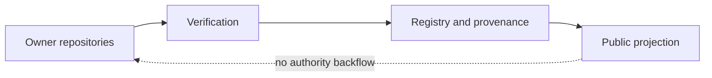

# Bootstrap Materialization Record — 2026-08-29

**Status:** PUBLIC PROJECTION EVIDENCE  
**Authority:** none by itself  
**Source basis:** GitHub repository metadata and commit history for `baum777/unitera_public_docs`, verified 2026-08-29

This record documents the initial public documentation bootstrap after the repository was created.

## Remote state before follow-up

- Repository: `baum777/unitera_public_docs`
- Visibility: public
- Default branch: `main`
- Verified bootstrap head: `62e5da0ded3877fa69ed35f94b710c7aaaaad869`

The initial bootstrap established the public projection boundary, governance, source discipline, Mermaid conventions, architecture summaries, runtime/security summaries, Registry publication flow, source basis, glossary, and current-state snapshot.

## Important interpretation

The bootstrap was written directly to `main` before this follow-up branch existed. This pull request does not rewrite or revert that history. It adds reviewable materialization evidence and subsequent current-state reconciliation.

## Authority posture

Public documentation remains downstream of owner authority and verified Registry/provenance references.
