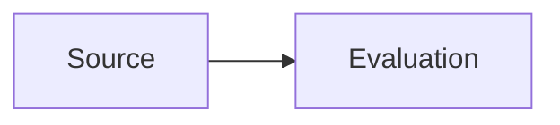
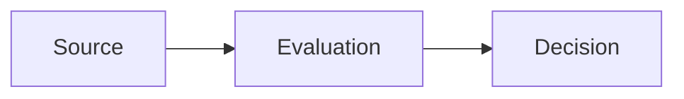
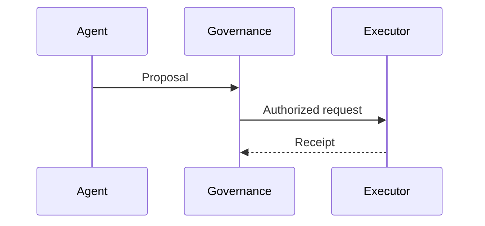
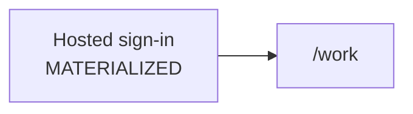

# Documentation & Diagram Conventions

**Status:** repository-local publication convention  
**Authority:** applies only to this public projection repository

## Document header

Every architecture/status page should begin with a compact status declaration:

```text
Status: PUBLIC PROJECTION | ESTABLISHED | MATERIALIZED | CANDIDATE | OPEN
Authority: none by itself
Source basis: owning repo / frozen source / candidate source
```

`PUBLIC PROJECTION` describes the document's role. It does not upgrade the maturity of the architecture described inside it.

## Technical vocabulary

Preserve canonical technical identifiers and casing:

- `UNITERA`
- `Unitera_Systems`
- `coreos`
- `unitera-os`
- `KNOW`
- `THINK`
- `ACT`
- `Company Brain`
- `Action Proposal`
- `Capability Request`
- `Capability Grant`
- `Receipt`
- `Verification`
- `email.send.commit`

Do not invent aliases for authority-bearing identifiers.

## Mermaid conventions

These rules are binding for this repository. The language-neutral contract is [`MERMAID.md`](../../../MERMAID.md). The renderer of record is GitHub-native Mermaid as documented in [Creating Mermaid diagrams on GitHub](https://docs.github.com/get-started/writing-on-github/working-with-advanced-formatting/creating-diagrams#creating-mermaid-diagrams).

Use GitHub-native Mermaid in Markdown. Do not depend on a local or third-party Mermaid plugin; GitHub documents that those plugins can error against GitHub’s syntax.

### Fence

Use a backtick fence with the `mermaid` language identifier. Do not use `~~~mermaid`.

````markdown

````

### Flow diagrams

Use `flowchart LR` for lifecycle or cross-boundary movement and `flowchart TB` for layered architecture.



### Sequence diagrams

Use `sequenceDiagram` when actor order and request/response semantics matter.



### Labels and GitHub parser hazards

Quote any node or subgraph label that contains `/`, `\\`, `<`, `>`, `#`, `;`, quotes, parentheses, or a line break. Use `<br>` inside the quoted label, never `<br/>`.



Unquoted `X[/work]` is invalid: `[/ ...]` is parallelogram shape syntax and breaks rendering on GitHub.

Never use `end`, `subgraph`, `graph`, or `flowchart` as a node ID. Do not use `click` handlers, `%%{init: ...}%%`, or color as the only carrier of authority, risk, or maturity.

### Boundary notation

- Solid arrow `-->`: normal data/control progression.
- Dotted arrow `-.->`: explanatory/reference relationship or prohibited authority backflow when labeled explicitly.
- Subgraphs: use for KNOW/THINK/ACT or clear trust/ownership domains.
- Do not rely on color alone to encode authority, risk, or maturity.

## Public wording rules

Prefer:

- “source-reconciled direction” over “finished architecture” when adoption is incomplete;
- “candidate” over “planned feature” when the source explicitly classifies it as candidate;
- “materialized in the owning runtime” only when verified;
- “receipt” and “verification” as separate concepts;
- “Registry reference” rather than “Registry authority”.

Avoid unverified claims of production readiness, compliance, certification, customer proof, or autonomous permission.
