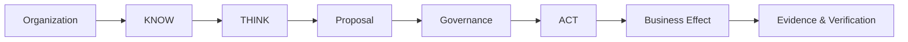

# UNITERA — Executive Architecture Overview

**Audience:** partners, customers, technical decision-makers  
**Status:** PUBLIC PROJECTION

## The problem UNITERA addresses

AI can already generate, analyze, and automate. The harder problem is deciding **when AI-assisted work may become binding business reality**.

UNITERA is designed as a governed intelligence layer between organizational context, AI cognition, human authority, and external systems.

## Three architectural promises

### 1. Context without silent permission

The system can compile richer organizational context without turning that context into authority.

### 2. Cognition without silent execution

Models can analyze, plan, simulate, and propose. They do not gain business authority merely because they can reason or call tools.

### 3. Execution with evidence

Binding effects pass through explicit capability, policy, approval/grant, execution, receipt, verification, and audit semantics.

## Why the architecture is split across repositories

Different kinds of truth have different owners. Foundation/Company Brain, provider-neutral execution contracts, runtime implementation, tenant control-plane authority, Registry references, and public documentation are intentionally separated so that no presentation layer can silently redefine system authority.

## Current maturity

UNITERA already has a substantially materialized bounded governance/runtime core. Broader cognition, product-surface convergence, tenant control-plane materialization, and candidate local-node capabilities remain areas where public documentation must track actual adoption rather than present target architecture as finished reality.
