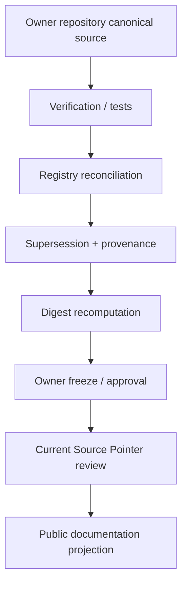

# Registry → Public Publication Flow

**Status:** PUBLIC PROJECTION of the current source-adoption model

The Registry is used as a cross-repo reference, provenance, adoption, supersession, and implementation-binding surface. It is not the originating Source of Truth for owner semantics.



## Fail-closed publication rule

Do not start with a pointer switch. Do not publish candidate material as canonical because it appears in a Registry package. Owner-surface materialization and verification come first; Registry reconciliation follows; pointer activation, when applicable, is a separate explicit decision.

## Recommended provenance footer

Public documents that summarize a specific owner artifact should carry a compact footer such as:

```yaml
projection:
  authority: none_by_itself
  source_repo: <owner/repository>
  source_ref: <commit-or-version>
  source_status: <canonical|frozen|candidate|open>
  registry_reference: <optional-registry-id>
  reviewed_at: <timestamp>
```
